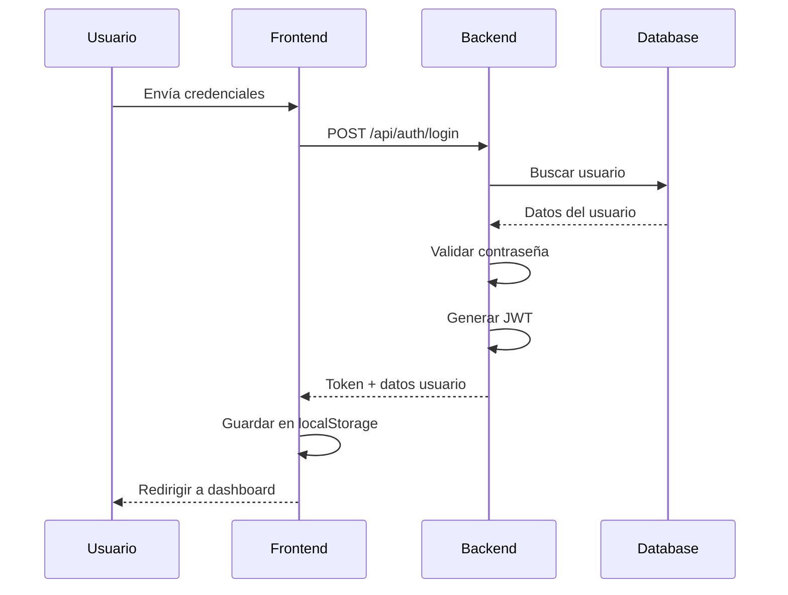
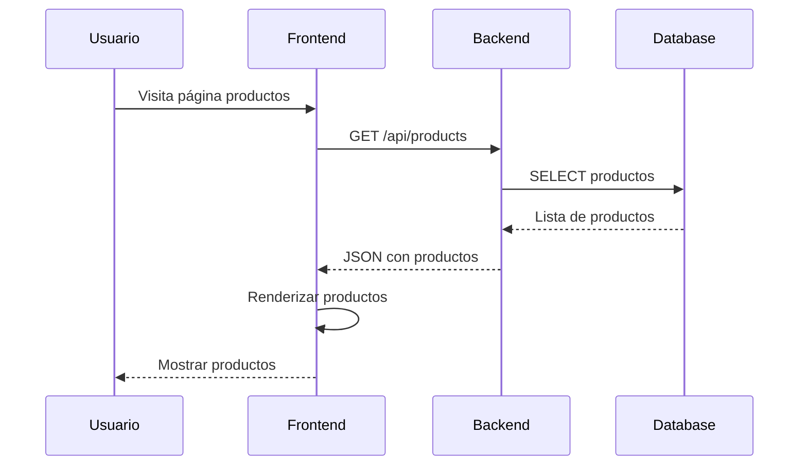
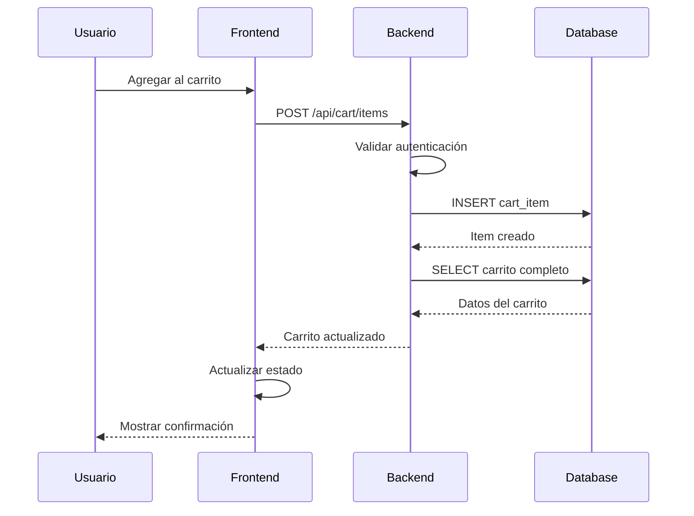

# Arquitectura del Sistema - Sistema de Venta de Software

## Tabla de Contenidos

1. [Visión General](#visión-general)
2. [Arquitectura Hexagonal](#arquitectura-hexagonal)
3. [Componentes del Sistema](#componentes-del-sistema)
4. [Flujo de Datos](#flujo-de-datos)
5. [Patrones de Diseño](#patrones-de-diseño)
6. [Seguridad](#seguridad)
7. [Escalabilidad](#escalabilidad)

## Visión General

El Sistema de Venta de Software está construido siguiendo principios de arquitectura limpia y patrones modernos de desarrollo. La aplicación se divide en dos componentes principales:

- **Backend**: API RESTful desarrollada con Node.js y Express
- **Frontend**: Aplicación web desarrollada con React 18

### Principios Arquitectónicos

1. **Separación de Responsabilidades**: Cada módulo tiene una responsabilidad específica
2. **Inversión de Dependencias**: Las dependencias apuntan hacia abstracciones
3. **Arquitectura Hexagonal**: Aislamiento del dominio de la infraestructura
4. **SOLID**: Aplicación de los principios SOLID en el diseño
5. **DRY**: No repetir código, reutilización de componentes

## Arquitectura Hexagonal

### Concepto

La arquitectura hexagonal (también conocida como Ports and Adapters) permite que el dominio de la aplicación sea independiente de los detalles de implementación externos como bases de datos, frameworks web, o interfaces de usuario.

### Estructura del Backend

```
src/
├── auth/                    # Módulo de Autenticación
│   ├── domain/             # Capa de Dominio
│   │   ├── entities/       # Entidades del dominio
│   │   ├── repositories/   # Interfaces (Puertos)
│   │   └── valueObjects/   # Objetos de valor
│   ├── application/        # Capa de Aplicación
│   │   ├── dtos/          # Data Transfer Objects
│   │   └── useCases/      # Casos de uso
│   └── infrastructure/     # Capa de Infraestructura
│       ├── controllers/    # Controladores HTTP
│       ├── repositories/   # Implementaciones (Adaptadores)
│       └── services/       # Servicios externos
├── products/               # Módulo de Productos
├── cart/                   # Módulo de Carrito
└── shared/                 # Componentes Compartidos
    └── infrastructure/
        ├── database/       # Configuración de BD
        └── middleware/     # Middleware HTTP
```

### Capas de la Arquitectura

#### 1. Capa de Dominio (Domain Layer)

**Responsabilidades:**
- Contiene la lógica de negocio pura
- Define las entidades y objetos de valor
- Establece las reglas de negocio
- Es independiente de frameworks y tecnologías

**Componentes:**
- **Entidades**: Objetos con identidad única (User, Product, CartItem)
- **Value Objects**: Objetos inmutables sin identidad (Email, Password)
- **Repositorios**: Interfaces para acceso a datos
- **Servicios de Dominio**: Lógica que no pertenece a una entidad específica

**Ejemplo - Entidad User:**
```javascript
class User {
    constructor(id, name, email, password, createdAt, updatedAt) {
        this.id = id;
        this.name = name;
        this.email = email;
        this.password = password;
        this.createdAt = createdAt;
        this.updatedAt = updatedAt;
    }

    static create(name, email, password) {
        // Validaciones de negocio
        if (!name || name.trim().length < 2) {
            throw new Error('El nombre debe tener al menos 2 caracteres');
        }
        
        return new User(null, name.trim(), email, password, new Date(), new Date());
    }

    updateProfile(name, email) {
        // Lógica de negocio para actualizar perfil
        this.name = name.trim();
        this.email = email;
        this.updatedAt = new Date();
        return this;
    }
}
```

#### 2. Capa de Aplicación (Application Layer)

**Responsabilidades:**
- Orquesta los casos de uso
- Coordina entre el dominio y la infraestructura
- Maneja la lógica de aplicación
- Define los DTOs para transferencia de datos

**Componentes:**
- **Casos de Uso**: Implementan los requisitos funcionales
- **DTOs**: Objetos para transferir datos entre capas
- **Servicios de Aplicación**: Coordinan múltiples casos de uso

**Ejemplo - Caso de Uso RegisterUser:**
```javascript
class RegisterUser {
    constructor(userRepository, emailService) {
        this.userRepository = userRepository;
        this.emailService = emailService;
    }

    async execute(registerUserDto) {
        // 1. Validar que el email no exista
        const existingUser = await this.userRepository.findByEmail(registerUserDto.email);
        if (existingUser) {
            throw new Error('El email ya está registrado');
        }

        // 2. Crear entidad de dominio
        const user = User.create(
            registerUserDto.name,
            registerUserDto.email,
            registerUserDto.password
        );

        // 3. Encriptar contraseña
        user.password = await bcrypt.hash(user.password, 10);

        // 4. Persistir usuario
        const savedUser = await this.userRepository.save(user);

        // 5. Enviar email de bienvenida (opcional)
        await this.emailService.sendWelcomeEmail(savedUser.email);

        return savedUser;
    }
}
```

#### 3. Capa de Infraestructura (Infrastructure Layer)

**Responsabilidades:**
- Implementa las interfaces definidas en el dominio
- Maneja detalles técnicos (BD, HTTP, archivos)
- Adapta tecnologías externas al dominio
- Configura frameworks y librerías

**Componentes:**
- **Controladores**: Manejan requests HTTP
- **Repositorios**: Implementan persistencia de datos
- **Servicios**: Integran con APIs externas
- **Middleware**: Procesan requests/responses

## Componentes del Sistema

### Backend Components

#### 1. Módulo de Autenticación

**Entidades:**
- `User`: Representa un usuario del sistema
- `Email`: Value object para emails válidos
- `Password`: Value object para contraseñas seguras

**Casos de Uso:**
- `RegisterUser`: Registro de nuevos usuarios
- `LoginUser`: Autenticación de usuarios
- `RecoverPassword`: Recuperación de contraseñas

**Servicios:**
- `JwtService`: Manejo de tokens JWT
- `EmailService`: Envío de correos electrónicos

#### 2. Módulo de Productos

**Entidades:**
- `Product`: Representa un producto de software

**Casos de Uso:**
- `GetProducts`: Obtener lista de productos
- `SearchProducts`: Búsqueda y filtrado de productos

**Repositorios:**
- `ProductRepository`: Acceso a datos de productos

#### 3. Módulo de Carrito

**Entidades:**
- `Cart`: Representa el carrito de un usuario
- `CartItem`: Representa un item en el carrito

**Casos de Uso:**
- `ManageCart`: Gestión completa del carrito

### Frontend Components

#### 1. Arquitectura de Componentes React

```
src/
├── components/
│   ├── ui/                 # Componentes base (shadcn/ui)
│   └── layout/             # Componentes de layout
├── pages/                  # Páginas de la aplicación
├── contexts/               # Contextos de React
├── hooks/                  # Custom hooks
└── lib/                    # Utilidades y configuración
```

#### 2. Gestión de Estado

**Context API:**
- `AuthContext`: Estado de autenticación global
- `CartContext`: Estado del carrito global

**Estado Local:**
- Formularios con `useState`
- Estados de carga y errores

#### 3. Enrutamiento

**React Router:**
- Rutas públicas: Home, Products, Login, Register
- Rutas protegidas: Profile, Cart
- Rutas dinámicas: Product Detail

## Flujo de Datos

### 1. Flujo de Autenticación



### 2. Flujo de Productos



### 3. Flujo de Carrito



## Patrones de Diseño

### 1. Repository Pattern

**Propósito:** Encapsular la lógica de acceso a datos

**Implementación:**
```javascript
// Interface (Puerto)
class UserRepository {
    async findById(id) {
        throw new Error('Método debe ser implementado');
    }
    
    async findByEmail(email) {
        throw new Error('Método debe ser implementado');
    }
    
    async save(user) {
        throw new Error('Método debe ser implementado');
    }
}

// Implementación (Adaptador)
class SqliteUserRepository extends UserRepository {
    async findById(id) {
        const row = await Database.get('SELECT * FROM users WHERE id = ?', [id]);
        return row ? this.mapRowToUser(row) : null;
    }
    
    async save(user) {
        const result = await Database.run(
            'INSERT INTO users (name, email, password) VALUES (?, ?, ?)',
            [user.name, user.email, user.password]
        );
        return new User(result.id, user.name, user.email, user.password);
    }
}
```

### 2. Dependency Injection

**Propósito:** Invertir las dependencias para mayor flexibilidad

**Implementación:**
```javascript
class AuthController {
    constructor() {
        // Inyección de dependencias
        this.userRepository = new SqliteUserRepository();
        this.emailService = new EmailService();
        this.registerUser = new RegisterUser(this.userRepository, this.emailService);
        this.loginUser = new LoginUser(this.userRepository);
    }
}
```

### 3. Factory Pattern

**Propósito:** Crear objetos sin especificar su clase exacta

**Implementación:**
```javascript
class UserFactory {
    static createFromRequest(requestData) {
        return User.create(
            requestData.name,
            requestData.email,
            requestData.password
        );
    }
    
    static createFromDatabase(row) {
        return new User(
            row.id,
            row.name,
            row.email,
            row.password,
            new Date(row.created_at),
            new Date(row.updated_at)
        );
    }
}
```

### 4. Observer Pattern (Frontend)

**Propósito:** Notificar cambios de estado a múltiples componentes

**Implementación con Context API:**
```javascript
const CartContext = createContext();

export const CartProvider = ({ children }) => {
    const [cart, setCart] = useState(initialState);
    
    const addItem = async (productId, quantity) => {
        // Lógica para agregar item
        const updatedCart = await cartService.addItem(productId, quantity);
        setCart(updatedCart); // Notifica a todos los observadores
    };
    
    return (
        <CartContext.Provider value={{ cart, addItem }}>
            {children}
        </CartContext.Provider>
    );
};
```

## Seguridad

### 1. Autenticación y Autorización

**JWT (JSON Web Tokens):**
- Tokens firmados con clave secreta
- Expiración configurable
- Payload mínimo para reducir tamaño

**Middleware de Autenticación:**
```javascript
class AuthMiddleware {
    static authenticate(req, res, next) {
        const token = req.headers.authorization?.replace('Bearer ', '');
        
        if (!token) {
            return res.status(401).json({ error: 'Token requerido' });
        }
        
        try {
            const decoded = jwt.verify(token, process.env.JWT_SECRET);
            req.user = decoded;
            next();
        } catch (error) {
            return res.status(401).json({ error: 'Token inválido' });
        }
    }
}
```

### 2. Validación de Datos

**Backend:**
- Validación en Value Objects
- Sanitización de inputs
- Validación de tipos de datos

**Frontend:**
- Validación en tiempo real
- Sanitización antes de envío
- Validación de formularios

### 3. Protección CORS

```javascript
app.use(cors({
    origin: process.env.CORS_ORIGIN,
    credentials: true,
    methods: ['GET', 'POST', 'PUT', 'DELETE'],
    allowedHeaders: ['Content-Type', 'Authorization']
}));
```

### 4. Seguridad HTTP

**Helmet.js:**
- Content Security Policy
- X-Frame-Options
- X-XSS-Protection
- Strict-Transport-Security

### 5. Encriptación de Contraseñas

```javascript
// Registro
const hashedPassword = await bcrypt.hash(password, 10);

// Login
const isValid = await bcrypt.compare(password, user.hashedPassword);
```

## Escalabilidad

### 1. Escalabilidad Horizontal

**Microservicios:**
- Separar módulos en servicios independientes
- Comunicación via API REST o mensajería
- Base de datos por servicio

**Load Balancing:**
- Nginx como proxy reverso
- Múltiples instancias del backend
- Session storage compartido (Redis)

### 2. Escalabilidad Vertical

**Optimización de Base de Datos:**
- Índices en columnas frecuentemente consultadas
- Paginación en consultas grandes
- Cache de consultas frecuentes

**Optimización de Memoria:**
- Streaming para archivos grandes
- Garbage collection optimizado
- Pool de conexiones a BD

### 3. Caching

**Niveles de Cache:**
1. **Browser Cache**: Archivos estáticos
2. **CDN**: Contenido global
3. **Application Cache**: Datos frecuentes
4. **Database Cache**: Consultas repetitivas

**Implementación con Redis:**
```javascript
class CacheService {
    static async get(key) {
        return await redis.get(key);
    }
    
    static async set(key, value, ttl = 3600) {
        return await redis.setex(key, ttl, JSON.stringify(value));
    }
}
```

### 4. Monitoreo y Observabilidad

**Logging:**
- Logs estructurados (JSON)
- Diferentes niveles (error, warn, info, debug)
- Rotación de archivos de log

**Métricas:**
- Tiempo de respuesta de APIs
- Uso de memoria y CPU
- Número de usuarios activos
- Errores por minuto

**Health Checks:**
```javascript
app.get('/health', (req, res) => {
    res.json({
        status: 'OK',
        timestamp: new Date().toISOString(),
        uptime: process.uptime(),
        environment: process.env.NODE_ENV
    });
});
```

## Consideraciones de Despliegue

### 1. Contenedorización

**Docker:**
- Imagen base Node.js Alpine
- Multi-stage builds
- Variables de entorno
- Health checks

### 2. CI/CD

**Pipeline:**
1. Tests unitarios
2. Tests de integración
3. Build de producción
4. Deploy automático
5. Tests de humo

### 3. Configuración de Producción

**Variables de Entorno:**
- Secrets management
- Configuración por ambiente
- Feature flags

**Base de Datos:**
- Migraciones automáticas
- Backups regulares
- Réplicas de lectura

---

Esta arquitectura proporciona una base sólida, mantenible y escalable para el Sistema de Venta de Software, siguiendo las mejores prácticas de la industria y permitiendo futuras extensiones y modificaciones.

